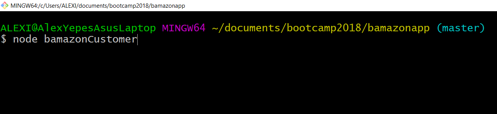
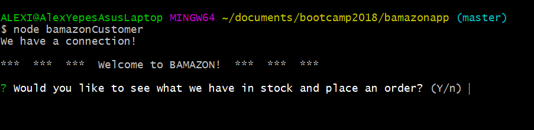
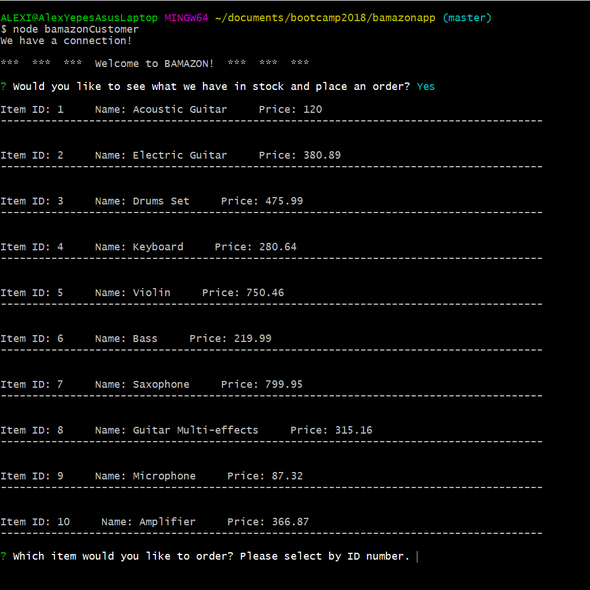
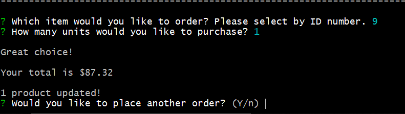
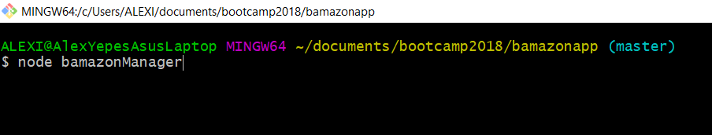
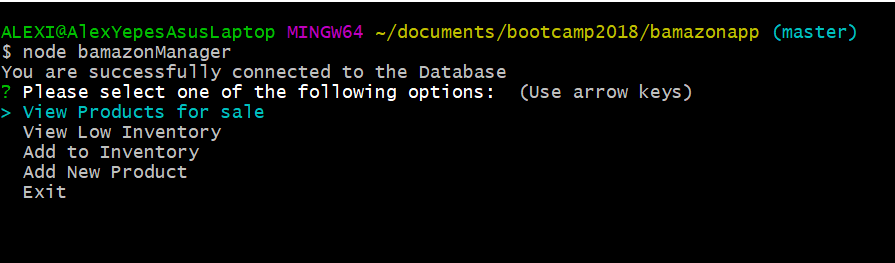

# Node.js and MySql Bamazon

Bamazon is an Amazon-like storefront created with MySQL and Node.js

The app will take in orders from customers and deplete stock from the store's inventory.

There is also an option for the Manager to view, update or create products.

## Technologies Used

* JavaScript

* [Node JS] (https://nodejs.org/en/)

* [Inquirer NPM] (https://www.npmjs.com/package/inquirer)

* [MySQL NPM] (https://www.npmjs.com/package/mysql)

* Visual Studio Code

## Instructions

### Customer Screen

Start by typing the inital commands:  node bamazonCustomer

Then, select yes (y) or no (n) to purchase an item:

A list with all available products and prices will be displayed

Then the user will select the Id number that matches the product to be purchased, and the number of units to buy

### Manager Screen

Start by typing the inital commands:  node bamazonManager

Then, the Manager options will be displayed on the screen:

Based on the choice selected, the Manager will follow the instructions to view, add, or create a product.
Here is the link for a quick demo where we can see how the app works.

https://youtu.be/Sk573qyyUxY

